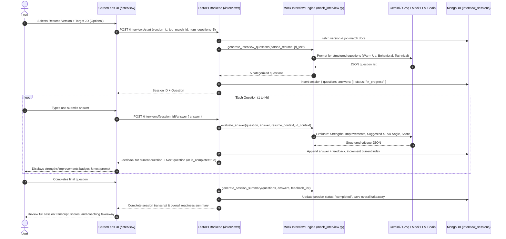

# Implementation Plan: Interactive Mock Interview Feature

CareerLens currently optimizes resumes via ATS scoring, semantic job matching, role benchmarking, and bullet-point rewriting. This feature extends CareerLens into active interview preparation by introducing a **Text-Based Interactive Mock Interview** tool that generates tailored interview questions from the user's parsed resume and target job description, accepts user responses turn-by-turn, provides structured constructive feedback, and renders a comprehensive session debrief.

---

## Architecture & System Flow

---

## Design Principles

- **Isolation Principle**: Interview feedback and scores are purely diagnostic and stored in `interview_sessions`. They will **never** alter or overwrite deterministic ATS scores or Job Match scores.
- **Multi-Tier Fallback**: LLM generation uses Gemini 1.5 Flash first, falls back to Groq (`llama-3.1-8b-instant`), and finally to a deterministic mock interview generator so the feature will **never crash** even without API keys or during network outages.
- **Session Scope**: Text-based only, untimed and calm practice flow, with default session length set to 5 questions (tunable constant `DEFAULT_INTERVIEW_QUESTIONS = 5`).

---

## Proposed Changes

### Backend Components

#### 1. [mock_interview.py](file:///c:/Users/Chakshita/OneDrive/Documents/CareerLens/mock_interview.py)
- Reuses the Gemini (`gemini-1.5-flash`) / Groq (`llama-3.1-8b-instant`) / Mock provider pattern established in `bullet_improver.py`.
- **`generate_interview_questions(parsed_resume: dict, jd_text: Optional[str], num_questions: int = 5) -> List[Dict]`**:
  - Synthesizes 3 types of questions:
    1. **Warm-Up**: e.g., "Walk me through your background and how your experience aligns with this role."
    2. **Behavioral (Grounded in Resume)**: Questions extracting actual company/project bullets from `parsed_resume["experience"]` or `parsed_resume["projects"]` (e.g., STAR situational queries).
    3. **Technical / Role-Specific**: Questions mapped to target JD requirements, checking depth on matching skills or probing skill gap areas.
  - Generates questions with context labels explaining *why* the question is being asked.
  - Robust JSON parsing and fallback generator if LLMs are unavailable.
- **`evaluate_answer(question: Dict, answer: str, parsed_resume: dict, jd_text: Optional[str]) -> Dict`**:
  - Evaluates user response across:
    - `strengths`: Concrete things done well (specific skills named, clear outcomes, relevance).
    - `improvements`: Gaps, missing metrics, lack of structured STAR method, ambiguity.
    - `suggested_angle`: Actionable reframing or STAR blueprint for a top-tier answer.
    - `score`: Rating out of 10.
    - `readiness_label`: "Strong Answer", "Good Foundation", or "Needs Polish".
- **`generate_session_summary(questions: List[Dict], answers: List[Dict], feedback_list: List[Dict]) -> Dict`**:
  - Aggregates overall performance, recurring strengths, key growth themes, and an executive readiness takeaway.

#### 2. [database.py](file:///c:/Users/Chakshita/OneDrive/Documents/CareerLens/database.py)
- Declare `COLLECTION_INTERVIEWS = "interview_sessions"`.
- Add helper `get_interviews_collection() -> AsyncIOMotorCollection`.

#### 3. [models.py](file:///c:/Users/Chakshita/OneDrive/Documents/CareerLens/models.py)
- Add Pydantic schemas:
  - `InterviewQuestion`: `index`, `category`, `question`, `context`, `suggested_focus`
  - `InterviewFeedback`: `strengths: List[str]`, `improvements: List[str]`, `suggested_angle: str`, `score: int`, `readiness_label: str`
  - `InterviewAnswerRecord`: `question_index`, `answer_text`, `feedback`, `answered_at`
  - `InterviewStartRequest`: `resume_version_id: str`, `job_match_id: Optional[str]`, `num_questions: int = 5`
  - `InterviewStartResponse`: `session_id: str`, `user_id: str`, `resume_version_id: str`, `job_match_id: Optional[str]`, `total_questions: int`, `first_question: InterviewQuestion`
  - `InterviewAnswerRequest`: `answer: str`
  - `InterviewAnswerResponse`: `session_id: str`, `question_index: int`, `feedback: InterviewFeedback`, `is_complete: bool`, `next_question: Optional[InterviewQuestion]`, `summary: Optional[Dict[str, Any]]`
  - `InterviewSessionDetailResponse`: Full session dump for resuming or reviewing past interviews.
  - `InterviewSessionSummaryItem`: Lightweight summary for listing sessions.

#### 4. [main.py](file:///c:/Users/Chakshita/OneDrive/Documents/CareerLens/main.py)
- Import `mock_interview` methods and `get_interviews_collection`.
- Implement endpoints:
  - `POST /interviews/start`: Validates version/match, generates question list via `asyncio.to_thread`, creates session in MongoDB, returns session ID + Question #1.
  - `POST /interviews/{session_id}/answer`: Evaluates user answer via `asyncio.to_thread`, updates session document, returns feedback + next question or triggers completion summary.
  - `GET /interviews/{session_id}`: Fetches and serialises session for review/resuming.
  - `GET /interviews/user/{user_id}`: Lists prior mock interview sessions for the user with score summaries.

---

### Frontend Components (careerlens-ui)

#### 1. [careerlens-ui/src/lib/api.ts](file:///c:/Users/Chakshita/OneDrive/Documents/CareerLens/careerlens-ui/src/lib/api.ts)
- Add TypeScript interfaces matching the backend models (`InterviewQuestion`, `InterviewFeedback`, `InterviewAnswerResponse`, `InterviewSessionDetail`).
- Add API functions:
  - `startInterview(versionId: string, jobMatchId?: string | null, numQuestions?: number): Promise<InterviewStartResponse>`
  - `submitInterviewAnswer(sessionId: string, answer: string): Promise<InterviewAnswerResponse>`
  - `getInterviewSession(sessionId: string): Promise<InterviewSessionDetail>`
  - `listUserInterviews(userId: string): Promise<InterviewSessionSummaryItem[]>`

#### 2. [careerlens-ui/src/components/layout/Navbar.tsx](file:///c:/Users/Chakshita/OneDrive/Documents/CareerLens/careerlens-ui/src/components/layout/Navbar.tsx)
- Add `{ href: '/interview', label: 'Interview', icon: MessageSquareCode }` to `NAV`.

#### 3. [careerlens-ui/src/app/interview/page.tsx](file:///c:/Users/Chakshita/OneDrive/Documents/CareerLens/careerlens-ui/src/app/interview/page.tsx)
- Build a multi-state interactive view matching CareerLens's optical/viewfinder design system:
  1. **Session Setup Screen**:
     - Resume Version selector (using `listVersions`).
     - Optional Job Match context selector (or toggle "Resume Only" vs "Target Specific JD").
     - Session parameter controls (5 questions, category breakdown preview).
     - "Initialize Mock Interview" button with optical aperture spinning indicator.
     - Past sessions drawer/card allowing review of previous mock interviews.
  2. **Active Q&A Terminal**:
     - Progress Bar & HUD: Question X of N, Category Badge (`Warm-Up`, `Behavioral STAR`, `Technical & JD Alignment`).
     - Context Card: "Why this question?" (explaining how it relates to specific resume bullets or JD requirements).
     - Answer Editor: Clean monospace/sans textarea, live word & character count, STAR method helper pill tags (`Situation`, `Task`, `Action`, `Result`).
     - Submit CTA with "Analyzing response..." scanline loader.
  3. **Feedback Inspection**:
     - Color-coded feedback container:
       - 🟢 **Strengths** (What worked well)
       - 🟡 **Areas to Polish** (Gaps, missed opportunities)
       - 🔵 **Suggested Stronger Angle** (Concrete reframing/coaching advice)
     - "Next Question →" or "View Session Debrief →" action button.
  4. **Session Summary & Debrief**:
     - Overall Readiness rating card.
     - Comprehensive transcript review: expand/collapse accordion for each question, answer, and feedback.
     - Key takeaways and coaching recommendations.
     - Action buttons: "Practice Another Session" or "Back to Job Match".
