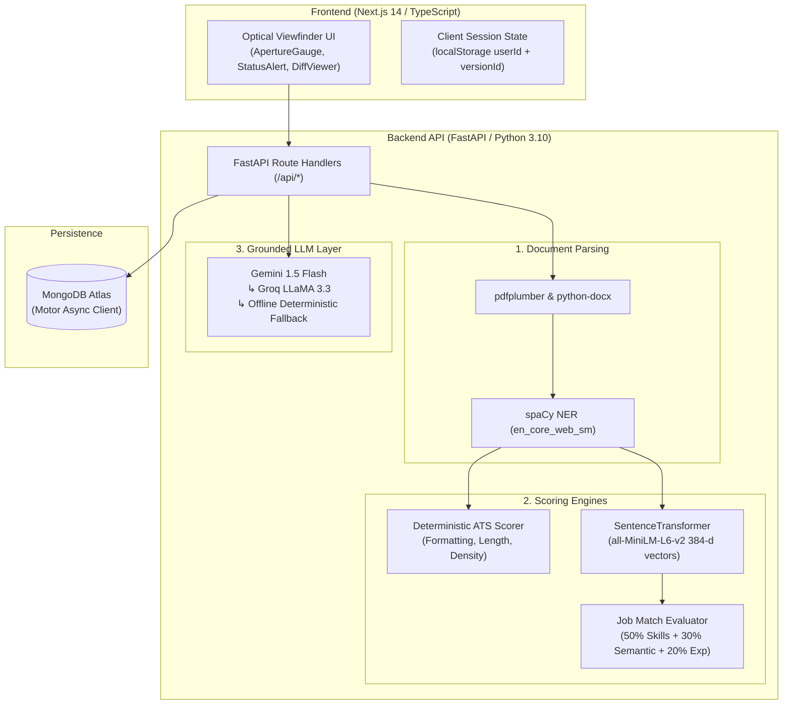

# CareerLens — AI-Powered Resume Intelligence & Job Matching Platform

[](https://careerlens-1-y5zn.onrender.com/)
[](https://careerlens-d3vi.onrender.com/docs)
[](LICENSE)

> **An AI career intelligence platform combining deterministic ATS validation, transformer-based semantic job matching, and grounded LLM interview coaching.**
> Built around an **Optical Viewfinder** design aesthetic where your career readiness is brought into razor-sharp focus (from *f/16 Out of Focus* to *f/1.4 Focus Locked*).

---

## 🌐 Live Production Deployments

- **Web Application:** [https://careerlens-1-y5zn.onrender.com/](https://careerlens-1-y5zn.onrender.com/)
- **REST API Backend:** [https://careerlens-d3vi.onrender.com/](https://careerlens-d3vi.onrender.com/)
- **Interactive Swagger Docs:** [https://careerlens-d3vi.onrender.com/docs](https://careerlens-d3vi.onrender.com/docs)

*(Note: Deployed on Render's free tier. If cold, the initial backend request spins up within ~30–50 seconds.)*

---

## ⚡ The Problem CareerLens Solves

Most job applicants send resumes into black-box Applicant Tracking Systems (ATS) without knowing if their document will parse properly, how closely their experience matches job descriptions, or how to speak about their projects during behavioral interviews.

Existing tools are either:
1. **Shallow keyword counters** that penalize natural synonyms (e.g. flagging someone who wrote "Postgres" instead of "Relational Databases").
2. **Ungrounded AI wrappers** that hallucinate fake metrics, invent false company names, or deliver vague compliments without constructive critique.

**CareerLens solves this with a three-layer hybrid architecture:**
- **Deterministic Rules Engine** for 100% predictable, transparent ATS formatting checks.
- **Local Sentence-Transformers** for semantic skill understanding without keyword fragility.
- **Grounded LLM Layer** with strict fallback chains (Gemini 1.5 → Groq LLaMA 3 → Offline Mock) for STAR bullet enhancement and multi-turn mock interviews.

---

## 🎯 Key Capabilities & Feature Matrix

| Feature | Technology | What it Delivers |
|---|---|---|
| **Deterministic ATS Audit** | Rule-Based Scoring Engine | Validates section completeness, contact details, bullet formatting, file length, and keyword density. Delivers an objective 0–100 score with explicit blockers and fixes. |
| **Semantic Job Matching** | `sentence-transformers` (`all-MiniLM-L6-v2`) | Understands skill context beyond exact keyword matches (e.g. maps "Kubernetes orchestration" to "Cloud infrastructure"). |
| **Multi-JD Role Comparison** | Vector Cosine Overlap Matrix | Paste 2–4 target job descriptions side-by-side to immediately determine which role has the strongest profile alignment. |
| **25+ Curated Role Benchmarks** | Domain Vector Profiles | Automatically maps your background against 25+ software, data, DevOps, and design roles to discover adjacent career paths and missing competencies. |
| **Grounded STAR Bullet Rewriter** | Gemini 1.5 / Groq LLaMA 3 | Rewrites passive bullet points into quantified **Action + Context + Impact** statements. Never invents claims; uses `[X%]` placeholders for metrics. |
| **Interactive Mock Interview** | LLM Multi-Turn Simulator | Roleplays behavioral and technical interviews generated specifically from your resume bullets and target JD. Grades responses against the STAR rubric. |
| **Version Delta Comparator** | Time-series History Engine | Compare Version A vs Version B side-by-side to track whether revisions sharpened or regressed your ATS score before submitting. |
| **Executive PDF Reports** | HTML5 / WeasyPrint | Generates a downloadable, beautifully typeset PDF summary with ATS audit breakdown and skill gap insights. |

---

## 🏛️ System Architecture



---

## 🔬 Honest Limits & Capability Breakdown

CareerLens is transparent about what technology powers each insight:

```
┌─────────────────────────────────────────────────────────────────────────┐
│ DETERMINISTIC (No AI, 100% Reproducible)                                │
│ • ATS score calculations (sections, word count, email/phone regex)      │
│ • Bullet count and metric presence detection                            │
│ • Version A vs. Version B score delta arithmetic                        │
├─────────────────────────────────────────────────────────────────────────┤
│ LOCAL NLP (Fast, No External API Calls, Zero Hallucinations)            │
│ • Skill keyword extraction via spaCy tokenization                       │
│ • Sentence-Transformers (all-MiniLM-L6-v2) 384-dimensional embeddings   │
│ • Cosine similarity calculation between resume and job description      │
├─────────────────────────────────────────────────────────────────────────┤
│ GENERATIVE LLM (Creativity Guardrailed by Prompts)                      │
│ • Bullet point improvement suggestions (STAR framework)                 │
│ • Interview question formulation from resume projects                   │
│ • Interview verbal critique & reframe suggestions                       │
└─────────────────────────────────────────────────────────────────────────┘
```

---

## 🛠️ Technology Stack & Engineering Decisions

### Frontend
- **Next.js 14 (App Router):** Server-side layout rendering with high-performance client transitions.
- **TypeScript:** Strict type safety across all API request/response payloads.
- **Tailwind CSS & Framer Motion:** Bespoke "Optical Lens" dark-mode aesthetic with custom SVG gauges, aperture reticles, and micro-animations.
- **Recharts:** Responsive time-series charts for version-over-version score progression.

### Backend
- **FastAPI (Python 3.10):** Asynchronous ASGI framework for sub-millisecond route dispatching and auto-generated OpenAPI 3.0 specs.
- **Motor (MongoDB):** Non-blocking async MongoDB driver for high-concurrency document operations.
- **Sentence-Transformers (`all-MiniLM-L6-v2`):** Lightweight, highly performant embedding model producing 384-dimensional vectors with minimal memory footprint on Render.
- **spaCy (`en_core_web_sm`):** Rule and token-based entity extraction for technical skills, degrees, and dates.
- **Google Generative AI & Groq:** Primary LLM inference via Gemini Flash with instantaneous Groq failover to ensure zero downtime.

---

## 💻 Local Development Setup

### 1. Clone the Repository
```bash
git clone https://github.com/Chakshita2123/CareerLens.git
cd CareerLens
```

### 2. Backend Setup (FastAPI)
```bash
# Create and activate virtual environment
python -m venv venv
source venv/bin/activate  # Windows: venv\Scripts\activate

# Install dependencies
pip install -r requirements.txt

# Download spaCy linguistic model
python -m spacy download en_core_web_sm

# Configure environment variables
cp .env.example .env
# Edit .env with your MONGODB_URI, GEMINI_API_KEY, and GROQ_API_KEY

# Start backend dev server
uvicorn main:app --reload --port 8000
```
Backend will be live at `http://localhost:8000` (Swagger docs at `http://localhost:8000/docs`).

### 3. Frontend Setup (Next.js)
```bash
cd careerlens-ui

# Install dependencies
npm install

# Start Next.js development server
npm run dev
```
Frontend will be live at `http://localhost:3000`.

---

## 📄 License & Attribution

Distributed under the MIT License. Developed with care by [Chakshita](https://github.com/Chakshita2123).
Questions or feedback? Open an issue or submit a pull request!
